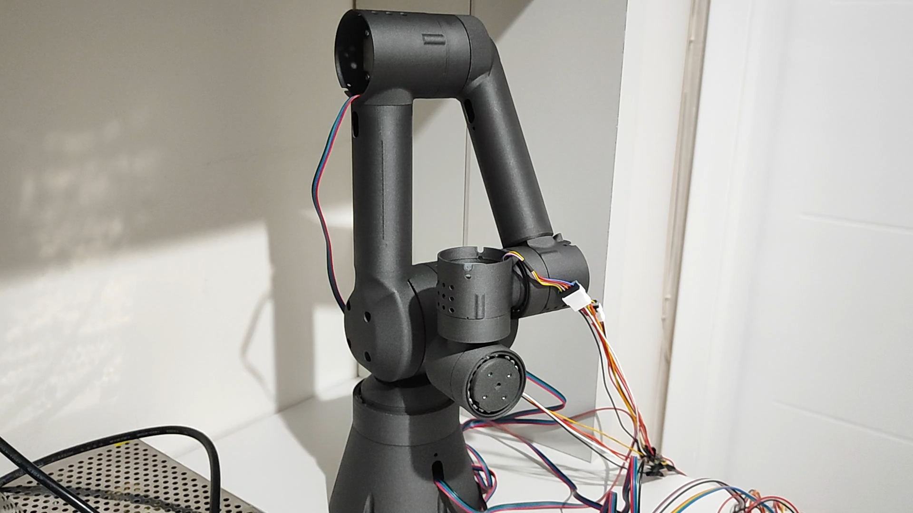
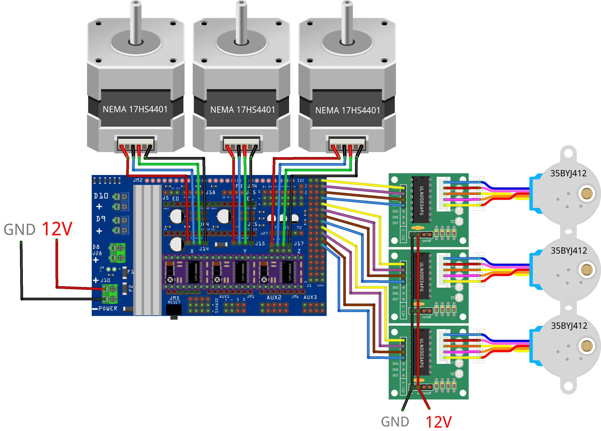

# 3D Printed 6-Axis Robot Arm

This repository contains the software, CAD modifications, and documentation for a 3D-printed 6-axis robot arm based on LoboCNC's original design.

## Hardware Diagram

## Project Links

The original 3D models for this build can be found here:

- **Robot Arm Body:** [WE-R2.4 Six-Axis Robot Arm (Printables)](https://www.printables.com/model/132260-we-r24-six-axis-robot-arm)
- **Actuators:** [Robot Actuators (Printables)](https://www.printables.com/model/132262-robot-actuators)

My YouTube channel, where you can watch the build process and future projects involving this robot arm:
- https://www.youtube.com/@ozguremreucar
## Components Used

| Item | Quantity |
| :--- | :--- |
| Nema 17HS4401 Stepper Motor| 3 |
| 35BYJ412 Stepper Motor| 3 |
| DRV8825 | 3 |
| ULN2003A | 3 |
| Arduino Mega | 1 |
| Reprap Ramps 1.6 Plus | 1 |
| 12V 20A Power Supply | 1 |
| 6mm Steel Ball | - |

## Project Structure

- `Assets/` - Contains images, diagrams, and other media related to the project.
  - `images/` - Photos of the build process and the completed robot arm.
  - `docs/` - Datasheets and other documentation.
- `CAD/` - Contains modified 3D models and CAD files.
- `Software/` - Contains the control code and related software for the robot arm.
